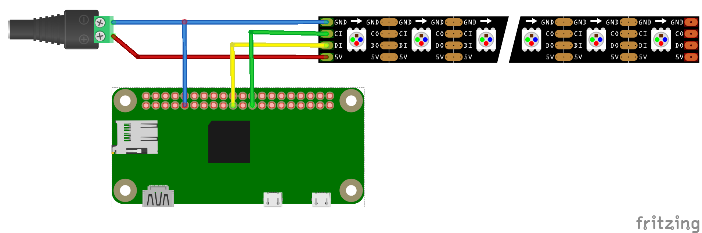

# Leucht

## Compile

### Host

```bash
# For pistache
sudo apt install libssl-dev

# For simulation with SDL
sudo apt install libsdl1.2-dev

# For playing radio streams
sudo apt install vlc

# For compiling
sudo apt install cmake git

./get_externals.sh
mkdir build
cd build
cmake ..
make -j
```

### RaspberryPi

```bash
mkdir build
cd build
export CROSS_COMPILE=$HOME/x-tools/armv6-rpi-linux-gnueabi/bin/armv6-rpi-linux-gnueabi-
export STAGING=$HOME/repo/raspberry/rootfs
cmake .. -DCMAKE_SYSROOT=${STAGING} -DCMAKE_CROSSCOMPILING=1 -DCMAKE_C_COMPILER=${CROSS_COMPILE}gcc -DCMAKE_CXX_COMPILER=${CROSS_COMPILE}g++ -DCMAKE_LIBRARY_PATH=${STAGING}/usr/lib -DCMAKE_SHARED_LINKER_FLAGS=--sysroot=${STAGING}
make -j
```

## Cross-Compile for Raspberry Pi Zero

The raspberry pi zero needs an arm6 compiler (see [here](https://raspberrypi.stackexchange.com/a/103756/113940).

### Install Crosstool-NG

```bash
./install_crosstool_ng.sh
```

### Build toolchain

```bash
ct-ng armv6-rpi-linux-gnueabi
ct-ng menuconfig
# Paths and misc options  ---> CT_PREFIX: ${CT_PREFIX:-./x-tools}/${CT_HOST:+HOST-${CT_HOST}/}${CT_TARGET}
ct-ng build
# Retry on download errors.
```

### Cross-Build pistache

```bash
./cross_prepare.sh
```

### Cross-Build Leucht

```bash
mkdir build
cd build
cmake .. -DCMAKE_TOOLCHAIN_FILE=../Toolchain-rpizero.cmake
make -j
```

## Hardware Setup

The wall is made up of 252 [WS2801](https://www.adafruit.com/product/738) pixels.
See https://learn.adafruit.com/12mm-led-pixels/wiring on how to set them up.

WS2801         | Raspberry     | Power Supply
---------------|---------------|--------------
5V (red)       |               | +V
CK/CI (green)  | Pin 23 (SCLK) |
SI/SD (yellow) | Pin 19 (MOSI) |
GND (blue)     | Pin 6 (GND    | -V


